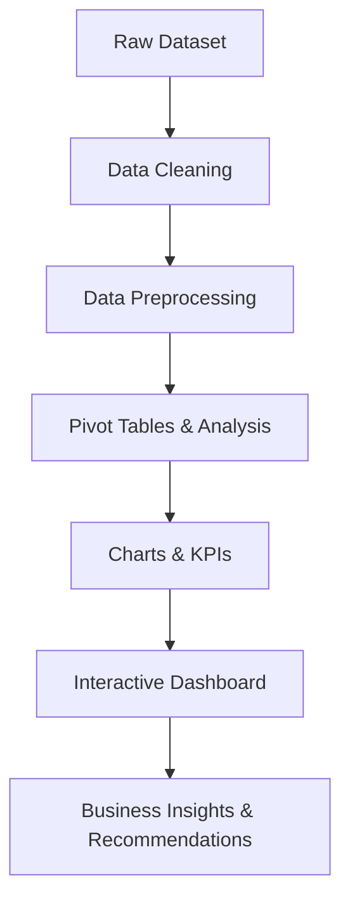

# Coffee-Shop-Sales-Analysis (Interactive Dashboard Creation using MS Excel) ☕

## Project Objective

The Coffee Shop aims to create a sales analysis dashboard to understand customer purchasing behavior, monitor business performance, and identify growth opportunities. The dashboard helps in making data-driven decisions to improve customer experience and increase overall sales.

---

## Project Workflow



---

## Dataset Used

Dataset Link:

https://github.com/OmkarTatkare/coffee-business-insights/blob/main/Project_Coffee_Shop.xlsx

---

## Dataset Description

The dataset contains transactional sales records from a coffee shop, including product details, sales revenue, store locations, order quantity, and time-based information used for sales analysis and dashboard creation.

### Files Included

| File Name | Description |
|------------|-------------|
| Project_Coffee_Shop.xlsx | Main dataset containing transaction records, product information, sales revenue, store locations, and order details |
| dashboard.png | Dashboard screenshot displaying key business insights and KPIs |

---

## Tools & Technologies Used

- Microsoft Excel
- Pivot Tables
- Pivot Charts
- Slicers
- Conditional Formatting
- Data Cleaning & Preprocessing
- Dashboard Design
- Lookup Functions (VLOOKUP/XLOOKUP)

---

## Repository Structure

```text
Coffee-Shop-Sales-Analysis/
│
├── README.md
├── dashboard.png
└── Project_Coffee_Shop.xlsx
```

---

## Business Questions (KPIs)

- Compare sales performance across different months.
- Which month generated the highest sales revenue?
- Which day recorded maximum sales?
- Analyze quantity sold based on hours.
- Which store location contributes the highest revenue?
- Which product category contributes maximum sales?
- Analyze size distribution based on orders.
- Identify top 5 products based on sales.
- Compare weekday sales performance.
- Average bill per person and average orders per person.

---

## Data Cleaning & Preprocessing

- Verified dataset for missing values and inconsistencies.
- Cleaned and transformed data for accurate analysis.
- Created additional columns such as Month Name, Day Name, Hour, and Total Bill.
- Checked data consistency and standardized formats.
- Built Pivot Tables for sales trends, product analysis, store performance, and hourly transaction analysis.

---

## Dashboard Features

### KPI Cards
- Total Sales
- Total Orders
- Average Bill per Person
- Average Orders per Person

### Interactive Filters
- Month
- Day
- Store Location
- Product Category

### Dynamic Visualizations
- Sales by Month
- Orders by Month
- Sales by Store Location
- Sales by Product Category
- Sales by Product Size
- Orders by Hour
- Top Selling Products
- Weekday vs Weekend Analysis

---

## Dashboard


---

## Project Insights

- June generated the highest overall sales among all months.
- Peak customer activity was observed between **8 AM and 11 AM**.
- **Hell's Kitchen** contributed the highest store revenue.
- Coffee products accounted for the maximum share of total sales.
- Large-sized beverages were ordered the most.
- Weekday sales were comparatively higher than weekend sales.
- Top-selling products included:
  - Barista Espresso
  - Brewed Chai Tea
  - Gourmet Brewed Coffee
- The average bill per person was approximately **4.69**.
- More than **1.44 orders per customer** were recorded on average.

---

## Final Conclusion

To improve sales and customer engagement, the Coffee Shop should focus on promoting high-performing beverage categories such as Coffee and Tea during peak morning hours. Since stores like Hell's Kitchen and Astoria generate strong revenue, targeted loyalty programs and localized promotional campaigns can further enhance customer retention and profitability.

---

## Author

**Omkar Tatkare**

GitHub: https://github.com/OmkarTatkare
